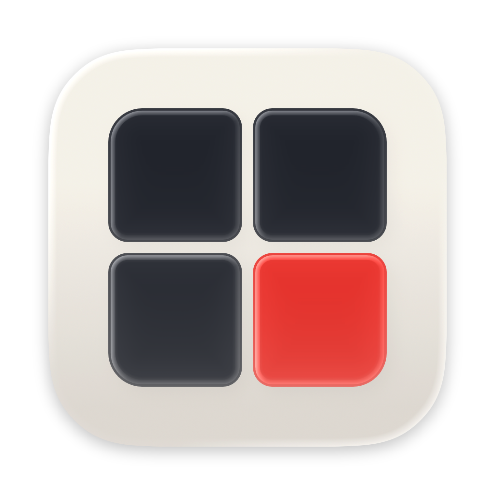

<!-- SPDX-FileCopyrightText: 2026 Nick Wolff <nick@wolff.tech> -->
<!-- SPDX-License-Identifier: GPL-2.0-only -->

<p align="center">
  
</p>

<h1 align="center">NES Wallpaper</h1>

<p align="center">
  Turn your Mac desktop into a living grid of NES games and tool-assisted speedruns.
</p>

NES Wallpaper runs games behind your desktop icons using the
[FCEUX](https://github.com/TASEmulators/fceux) emulator and FM2 movies from
[TASVideos](https://tasvideos.org). It is a modern macOS recreation of the 2016
UberNES “Nintendo Saver.”

> [!IMPORTANT]
> ROMs are not included. You must provide your own legally obtained NES ROMs.

## Features

- A configurable, multi-display grid rendered as your desktop wallpaper
- Automatic ROM and FM2 matching, rotation, and TASVideos browsing
- CRT-style video filters and a 30 fps Low Power Mode
- Live keyboard takeover for playing any tile
- An optional companion screensaver, including lock-screen playback
- Menu bar controls, a configurable global takeover shortcut, launch at login,
  and remappable controls

## Install

NES Wallpaper requires macOS 14 or later.

1. Download the signed `.dmg` from [GitHub Releases](https://github.com/WolffTech/nes-wallpaper/releases) when one is available, or [build from source](#build-from-source).
2. Open the disk image and drag **NES Wallpaper.app** to **Applications**.
3. Open NES Wallpaper from **Applications**.
4. In **Settings → Library**, choose folders containing your `.nes` ROMs and `.fm2` movies.

The app lives in the menu bar. You can download FM2 movies from the built-in
TASVideos browser; NES Wallpaper matches them to compatible ROMs by checksum.

Press **Control-Option-G** from any app to raise the wallpaper and click the
game you want to play. Change or disable this shortcut in **Settings →
Controls**.

To use the screensaver, open **Settings → General**, install it, then select
**NES Wallpaper** in macOS **System Settings → Wallpaper → Screen Saver**.

## Build from source

Install Xcode Command Line Tools, clone the repository, then run:

```sh
./Scripts/make-app.sh
open "dist/NES Wallpaper.app"
```

For development:

```sh
swift build
swift test
./Scripts/smoke-test.sh
```

See [`vendor/VENDOR.md`](vendor/VENDOR.md) for details about the vendored FCEUX
core.

## License

NES Wallpaper is free software licensed under
[GPL-2.0-only](LICENSE). Third-party attributions are listed in
[`THIRD_PARTY_NOTICES.md`](THIRD_PARTY_NOTICES.md), and information about the
corresponding source included with releases is in [`SOURCE.md`](SOURCE.md).
